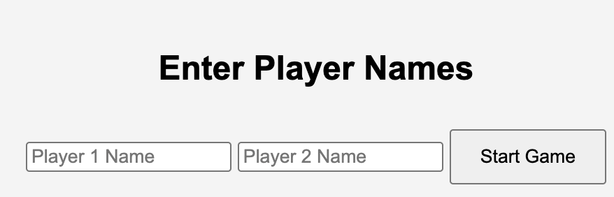
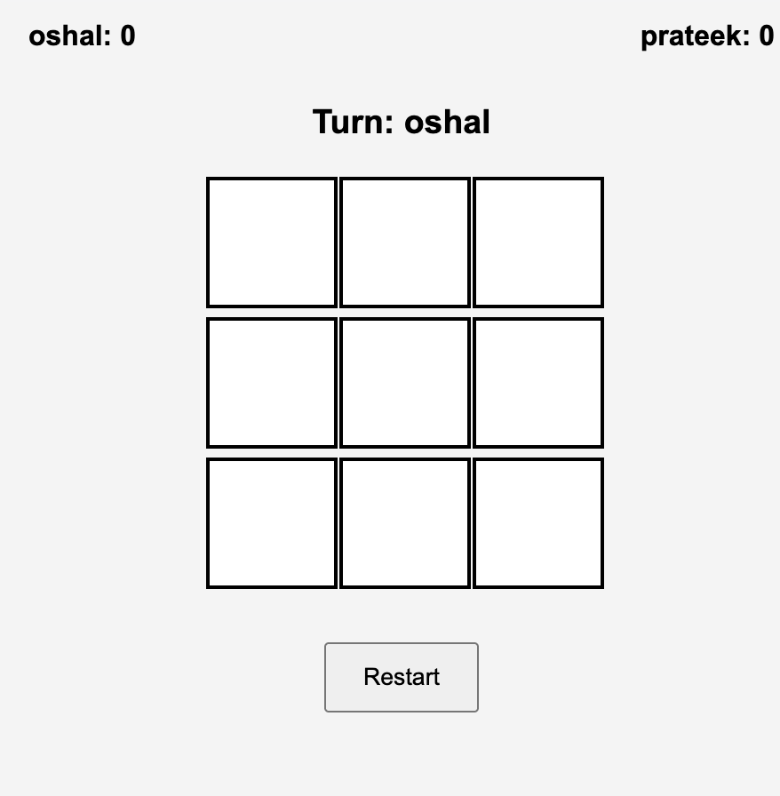
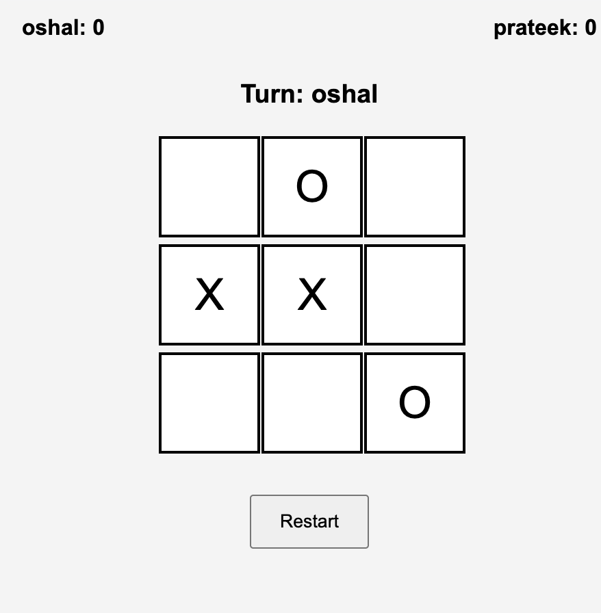
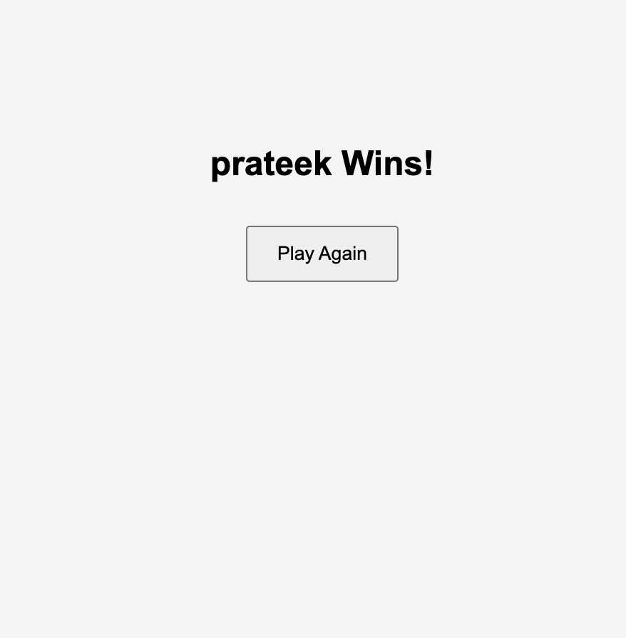

# Tic Tac Toe Game

## Overview

This project is a simple **two-player Tic Tac Toe game** built using **HTML, CSS, and JavaScript** as part of the **SWD Nucleus Induction Task**.

The application allows two players to enter their names and play a **Tic Tac Toe game** in the browser. The interface is designed to be simple and responsive so that it works on both **desktop and mobile devices**.

---

## Features

* Two-player gameplay
* 3×3 Tic Tac Toe board
* Alternating turns between players
* Win and draw detection
* Restart game option
* Responsive user interface for mobile and desktop

---

## Game Flow

1. When the game starts, both players enter their names.
2. The Tic Tac Toe board appears.
3. Players take turns placing their marks (**X** and **O**).
4. The game detects:

   * Winning combinations
   * Draw condition
5. After a win or draw, a result screen is displayed with an option to restart the game.

---

## Screenshots

### Initial Stage

### Gameplay Example 1

### Gameplay Example 2

### Win State

---

## Known Limitations

The task required storing and retrieving **player scores using `localStorage`** so that scores persist after refreshing the page.

However, I was **not able to successfully implement the score tracking and localStorage functionality** within the current version of the project. The gameplay works correctly, but score counting is not yet implemented.

---

## Technologies Used

* **HTML** – Structure of the game interface
* **CSS** – Styling and responsive layout
* **JavaScript** – Game logic and interactions

---

## How to Run the Project
Open [this link](https://prateekmirchandani.github.io/swd-tictactoe/).

---

## AI Usage
## AI Usage

I want to be honest about how this project was made.

I currently don’t know web development (HTML, CSS, JavaScript) yet. As I mentioned in my induction form as well, I mainly used **ChatGPT** to help me build this project. I asked it to generate the code for the Tic Tac Toe game and then tried to understand the basic structure of how the files and logic work.

I also discussed parts of the code with a friend so I could get a rough idea of what each section is doing.

ChatGPT was mainly used for:

* Generating the game code
* Understanding the basic structure of the project
* Writing parts of the README

Since the time frame for the task was quite short, I wasn’t able to properly learn HTML, CSS, and JavaScript and write the whole code on my own. My main goal while doing this was to at least understand the basic flow of how such a project works.

I plan to properly learn web development later so I can build similar projects myself.

---

## Author

Prateek Mirchandani
